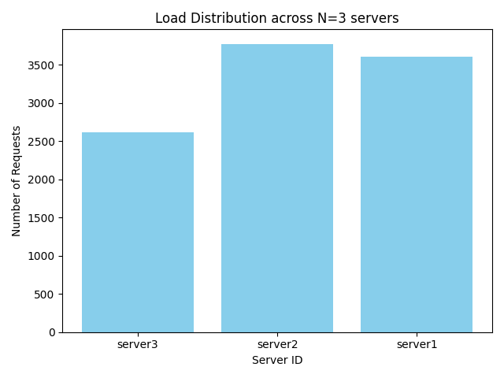
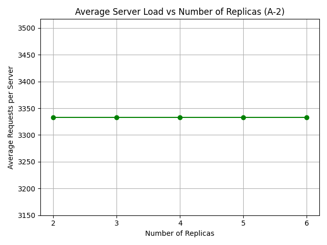

# Distributed Systems Load Balancer Project

## 📘 Overview

This project implements a **load balancer with consistent hashing** for fault-tolerant, scalable web servers in a containerized environment. It supports:

- Adding/removing web server replicas dynamically  
- Routing HTTP requests using consistent hashing  
- Automatic failure detection via heartbeat monitoring  
- Auto-recovery of failed replicas  
- Frontend for tech stack voting  
- Performance testing scripts

---

## ⚙️ Technology Stack

- **Python 3.9**  
- **Flask** – used for web server and load balancer  
- **Docker & Docker Compose** – for container orchestration  
- **aiohttp + asyncio** – for sending async test requests  
- **Matplotlib** – for graphing test results  

---

## 🐳 Local Deployment (Docker Compose)

> ✅ Prerequisite: Docker must be installed and running

### 1. Clone the repository

```bash
git clone https://github.com/joabodo/Distributed-System-Project.git
cd Distributed-System-Project
```

### 2. Build and launch all containers

```bash
docker-compose build
docker-compose up -d
```

### 3. Verify running containers

```bash
docker ps
```

---

## 🔁 API Endpoints (via Load Balancer at `localhost:5000`)

| Endpoint         | Method | Description                            |
|------------------|--------|----------------------------------------|
| `/add`           | POST   | Add server replicas                    |
| `/rm`            | DELETE | Remove replicas                        |
| `/rep`           | GET    | View current replicas                  |
| `/home`          | GET    | Proxy request to one server via hashing |
| `/api/vote`      | POST   | Submit a vote (used by frontend)      |
| `/api/votes`     | GET    | Get live vote counts                   |

---

## 🧪 A-Series Analysis

### ✅ A-1: Load Distribution (Fixed N=3)

- **Script:** `test_scripts/test_a1_load_distribution.py`  
- Sends 10,000 async requests to `/home`  
- **Generates a bar chart** showing how many requests each server handled  

> Output: 

---

### ✅ A-2: Scalability Test (N = 2 to 6)

- **Script:** `test_scripts/test_a2_scalability_test.py`  
- Adds 2 to 6 replicas and sends 10,000 requests per run  
- **Plots the average load per server** in a line graph  

> Output: 

---

### ✅ A-3: Failure & Auto-Recovery Test

- **Script:** `test_scripts/test_a3_failover_and_recovery.py`  
- Adds 3 replicas, stops one container manually  
- The load balancer detects failure via `/heartbeat` and spawns a replacement

> Log Example:
```
[⚠️] Heartbeat failed for server2
[❌] Removing server2
[🆕] Spawning replacement: Server-abcd
```

---

### ✅ A-4: Hash Function Modification

> Original hash: Python's built-in `hash()`  
> Modified hash:
- `H(i)` = `sha256(i)`
- `Φ(i,j)` = `md5(server_id-replica_id)`

**Results:**
- More balanced bar chart in A-1
- Smoother average loads in A-2  
- Shows improved uniformity in consistent hashing distribution

---

## 📂 Project Structure

```
.
├── load_balancer/
│   ├── app.py
│   ├── static/ (frontend HTML)
│   └── Dockerfile
├── server/
│   ├── app.py
│   └── Dockerfile
├── test_scripts/
│   ├── test_a1_load_distribution.py
│   ├── test_a2_scalability_test.py
│   └── test_a3_failover_and_recovery.py
├── consistent_hash.py
├── docker-compose.yml
├── a1_load_distribution.png
├── a2_avg_load_plot.png
└── README.md
```

---

## 🙌 Author


- **Joab Bodo**
- **Nathaniel Shibadu**
- **Alvin Nathey Kariuki**

**Distributed Systems Project – 2025**  
**Course:** ICS 4A

---

## 🧹 Cleanup

To stop and remove containers:

```bash
docker-compose down
```

To remove all images and containers:

```bash
docker system prune -af
```
